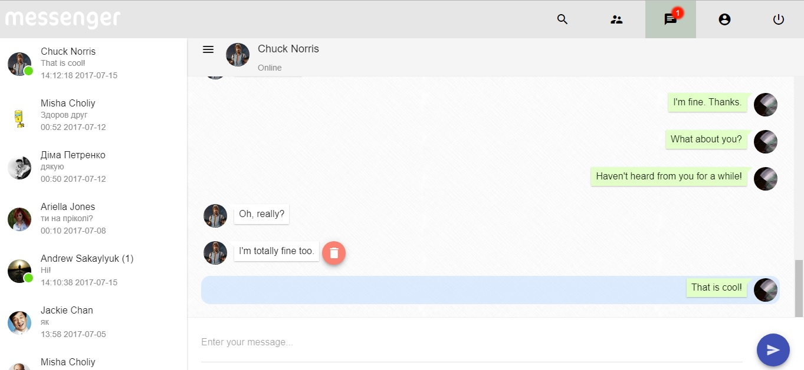

	

## Technologies:
- Angular (4.2.5)
- Angular/Material (2.0.0-beta.8)
- SignalR (2.2.2)
- Microsoft.AspNet.WebApi (5.2.3)  
- EntityFramework (6.1.3)       
- System.IdentityModel.Tokens.Jwt (5.1.3)   
- Unity.WebAPI (5.2.3)    
- Automapper (6.0.2) 

  

# Build
- Open Server in [Visual Studio](https://www.visualstudio.com/thank-you-downloading-visual-studio/?sku=Community&rel=15).      
- Build Client using [angular-cli](https://www.npmjs.com/package/@angular/cli) command `ng build -prod`. 
- Move all files from your `dist` folder in your Angular project to `wwwroot` folder in your server project. 

# Web Client

## Development server

Run `ng serve` for a dev server. Navigate to `http://localhost:4200/`. The app will automatically reload if you change any of the source files.

## Code scaffolding

Run `ng generate component component-name` to generate a new component. You can also use `ng generate directive|pipe|service|class|module`.

## Build

Run `ng build` to build the project. The build artifacts will be stored in the `dist/` directory. Use the `-prod` flag for a production build.

# Server

Database:
----------
Use `<connectionStrings>` in Web.config to configure your database connection. 

Configure JWT:
--------------
Use `<appSettings>` in Web.config to set AudienceSecret.

Server API:
-------
|API                    |Description            |Request body   |Response body       |
|:----------------------|:----------------------|:--------------|:-------------------|
|POST /api/account/signup |User registration |JSON with UserName, Password, ConfirmPassword, Email, FirstName, LastName, BirthDate, Sex |JSON with Token, Id, UserName, FirstName, LastName, Email, BirthDate, Sex |
|POST /api/account/signin |Login user |JSON with UserName, Password |JSON with Token, Id, UserName, FirstName, LastName, Email, BirthDate, Sex | 
|POST /api/account/refreshToken|Refresh Token|None|JSON with new Token| 
|GET /api/users/\{id\} |Get user by ID|None|JSON with First, Second (First - JSON (array of objects) with Id, UserName, FirstName, LastName, Email, BirthDate, Sex, AvatarUrl, Online; Second - JSON (number of pages))|
|GET /api/users/\{username\} |Get user by UserName|None|JSON with First, Second (First - JSON (array of objects) with Id, UserName, FirstName, LastName, Email, BirthDate, Sex, AvatarUrl, Online; Second - JSON (number of pages))|
|GET /api/users?\[search parameters\]&p=\{page\}      (example: GET /api/users?UserName=admin&Sex=Male&p=1)|Find user by some parameters such as UserName, FirstName, LastName, Email, BirthDate, Sex (any combinations, if nothing - get all users)|None|JSON with First, Second (First - JSON (array of objects) with Id, UserName, FirstName, LastName, Email, BirthDate, Sex, AvatarUrl, Online; Second - JSON (number of pages))|
|DELETE /api/users|Delete user|None|None|
|PUT /api/users|Change userinfo|JSON with FirstName, LastName, Email, BirthDate, Sex|JSON with FirstName, LastName, Email, BirthDate, Sex|
|PUT /api/users/ChangePassword|Change Password|JSON with OldPassword, NewPassword, ConfirmPassword|JSON with new Token|
|PUT /api/users/ChangeUsername|Change UserName|JSON with UserName|JSON with UserName and new Token| 
|POST /api/users/UploadAvatar|Upload avatar|Image|JSON with AvatarUrl|
|POST /api/friends/add/\{receiverId\}|Send friend request to user(receiver)|None|None|
|PUT /api/friends/confirm/\{senderId\}|Confirm friend request from user(sender)|None|None|
|GET /api/friends/onlineCount|Get number of online friends|None|JSON (number of online friends)|
|GET /api/friends/count|Get number of friends|None|JSON (number of friends)|
|GET /api/friends?p=\{page\}|Get friends|None|JSON with First, Second (First - JSON (array of objects) with Id, UserName, FirstName, LastName, Email, BirthDate, Sex, AvatarUrl, Online; Second - JSON (number of pages))|
|GET /api/friends/requests?p=\{page\}|Get all users, which sent requests to this user|None|JSON with First, Second (First - JSON (array of objects) with Id, UserName, FirstName, LastName, Email, BirthDate, Sex, AvatarUrl, Online; Second - JSON (number of pages))|
|GET /api/friends/mutual?userId=\{userId\}&p=\{page\}|Get mutual friends|None|JSON with First, Second (First - JSON (array of objects) with Id, UserName, FirstName, LastName, Email, BirthDate, Sex, AvatarUrl, Online; Second - JSON (number of pages))|
|GET /api/friends/shortestPath?userId=\{userId\}|Get shortest path between users|None|JSON (array of objects) with Id, UserName, FirstName, LastName, Email, BirthDate, Sex, AvatarUrl, Online|
|DELETE /api/friends/\{friendId\}|Delete friendship|None|None|
|GET /api/friends/areFriends?userId=\{userId\}&friendId=\{friendId\}|Check if two users are friends|None|true/false|
|GET /api/friends/friendshipRequestAlreadyExists?senderId=\{senderId\}&receiverId=\{receiverId\}|Check if friendship request already exists|None|true/false|

##### This service uses SignalR technology. The main functionality in MessageHub is:
|Method signature (Server) |Description            |Callback (Client)   |Callback invocation  |
|:-------------------------|:----------------------|:-------------------|:--------------------|
|void SendMessage(int userId, string text)|Send message|OnSendMessage([JSON with Id, DateTime, Text, FirstName, SenderId, New], [JSON (number of pages)])|All this user and specified user's online clients| 
|void MakeMessagesOld(int[] messagesIds)|Make specified messages old|OnMakeMessagesOld([JSON (array of message ids)])|All message sender's online clients|
|int GetNewMessagesCount()|Get number of all this user's new messages|None|None|
|Pair\<int, int\> GetNewMessagesCountWith(int userId)|Get number of this user and specified user's new messages|None|None|
|void GetCorrespondence(int userId, int page)|Get messages between this user and the one with userId|OnGetCorrespondence([JSON (array of objects) with Id, DateTime, Text, FirstName, SenderId, New], [JSON (number of pages)])|Caller|
|void GetConversations(int page)|Get this user's conversations|OnGetConversations([JSON (array of objects) with Text, FirstName, LastName, DateTime, OtherUserId, NewMessagesCount, AvatarUrl, Online], [JSON (number of pages)])|Caller|
|void RemoveMessage(int messageId)|Remove message|OnRemoveMessage([JSON (message id)], [JSON (number of pages)])|All this user and specified user's online clients|
|void TypeMessage(int receiverId)|Notify about typing message|OnTypeMessage([JSON (sender id)])|All specified receiver's online clients|
|void NotTypeMessage(int receiverId)|Notify about stopping to type message|OnNotTypeMessage([JSON (sender id)])|All specified receiver's online clients|
|void UserOnline()|Notify that user entered|OnUserOnline([JSON (sender id)])|All online users|
|void UserOffline()|Notify that user exited|OnUserOffline([JSON (sender id)])|All online users|

#### Warning:        
All API (except signup and signin) need Header `Authorization` with user's token.       
Send Token in header `Authorization` using next format: `Bearer <your JWT>`.    
Token is valid for 1 hour. Currently add token to client hub query string when calling MessageHub's methods.